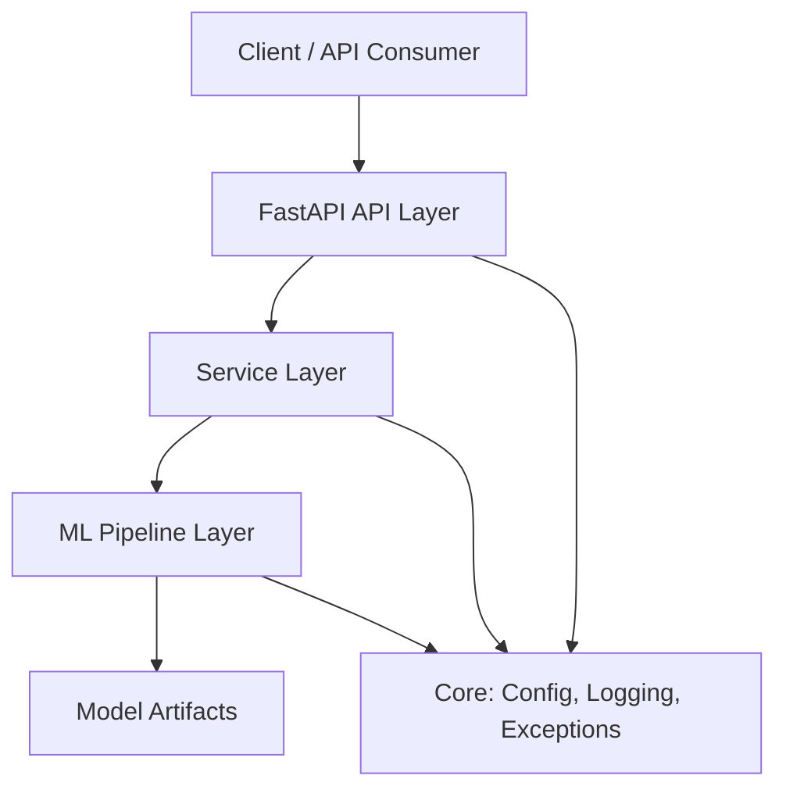

# ML Project Template

Production-ready template for building scable ML applications.

---

## Why this project?

Starting a new ML project often requires setting up the same infrastructure repeatedly: project structure, configuration management, logging, testing, Docker, CI pipelines, and API boilerplate.

This template provides a production-oriented foundation, allowing you to focus on developing ml solutions instead of rebuilding infrastructure for every new project.

---

## Features

- Modular project architecture
- Enviroment-based configuration
- Structured logging
- REST API with FastAPI
- Docker support
- Automated testing
- Continuous Integration

---

## Tech Stack

| Category | Technologies |
|----------|--------------|
| Language | Python 3.11 |
| API | FastAPI |
| Configuration | Pydantic Settings, YAML |
| ML | ... |
| Testing | Pytest |
| Formatting | Ruff, Black |
| Containerization | Docker, Docker Compose |
| CI/CD | GitHub Actions |

---

## Architecture

The template follows a layered architecture that separates API logic, service orchestration, ML components and model artifacts.

The architecture separates infrastructure from business logic.

Each layer has a single responsibility, making the template easer to maintain, test and extend.

---

## Project Structure

| Directory | Purpose |
|-----------|---------|
| src/api | FastAPI application and request handing |
| src/services | Business logic |
| src/ml | ML pipeline |
| src/core | Configuration and infrastructure |
| tests | Automated tests |

---

## Getting Started

---

## Development

---

## Docker

---

## CI/CD

---

## Roadmap

---

## Lincense